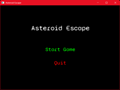
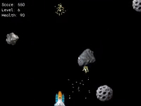
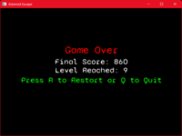

# 🚀 Asteroid Escape

Asteroid Escape is a 2D space shooter game built with C++ and SFML. Control your spaceship, destroy incoming asteroids, survive through increasingly difficult levels, and aim for the highest score! The game features smooth controls, particle effects, object pooling for performance, and a modular state-based architecture.

Note: Uses 3rd party assets that are downloaded randomly from the internet. Created just for study purposes.

---

## 📌 Table of Contents

- [Features](#-features)
- [Gameplay & Controls](#-gameplay--controls)
- [Screenshots](#-screenshots)
- [Gameplay Video](#-gameplay-video)
- [Project Structure](#-project-structure)
- [Platform Support](#-platform-support)
- [Dependencies](#-dependencies)
- [Building with CMake](#-building-with-cmake)
- [Future Improvements](#-future-improvements)
- [Conclusion](#-conclusion)

---

## 🌟 Features

- Smooth spaceship movement with arrow keys / A & D
- Shoot asteroids to earn points
- Increasing difficulty with each level
- Particle effects for destroyed asteroids
- Object pooling for bullets, asteroids, and particles for efficient memory usage
- Start menu, gameplay, and game over screens
- HUD showing score, level, and health
- Modular architecture using State Machine

---

## 🎮 Gameplay & Controls

- Movement: Arrow keys / A & D
- Shoot: Spacebar
- Quit: ESC key
- Avoid collisions with asteroids
- Destroy asteroids to earn points and progress levels
- Each asteroid destroyed generates particle effects for visual feedback
- Game ends when player health reaches 0, showing final score and level

---

## 📷 Screenshots

| Main Menu | Gameplay | Game Over |
|-----------|----------------|-------------------|
|  |  |  |

---

## 🎥 Gameplay Video

Click the image below to watch the gameplay video 👇:
 
[](https://www.canva.com/design/DAGyHfj_Jis/BzIDwIWcGvXJM_zrnW3ftw/edit?utm_content=DAGyHfj_Jis&utm_campaign=designshare&utm_medium=link2&utm_source=sharebutton)

---

## 🗂 Project Structure

| Folder / File          | Description                                                      |
| ---------------------- | ---------------------------------------------------------------- |
| `Game.cpp / Game.h`    | Main game loop, state management, HUD, and initialization        |
| `GameState.h`          | Base class for all states (StartMenu, Playing, GameOver)         |
| `StartMenuState.cpp/h` | Start menu with title, Start, and Quit options                   |
| `PlayingState.cpp/h`   | Gameplay logic, spawning asteroids, collision handling           |
| `GameOverState.cpp/h`  | Game over screen, score, and restart/quit options                |
| `GameObject.cpp/h`     | Base class for all game objects (Player, Asteroid, Bullet)       |
| `Player.cpp/h`         | Player movement, shooting, and health management                 |
| `Asteroid.cpp/h`       | Asteroid movement and collision detection                        |
| `Bullet.cpp/h`         | Bullet movement and collision detection                          |
| `Particle.cpp/h`       | Individual particle for explosion effects                        |
| `ParticleSystem.cpp/h` | Manages all particle effects                                     |
| `AssetManager.cpp/h`   | Loading and managing textures                                    |
| `SoundManager.cpp/h`   | Playing sound effects and music                                  |
| `GenericObjectPool.h`  | Template-based object pool for bullets, asteroids, and particles |
| `CMakeLists.txt`  | Build configuration (handles SFML linking, copying DLLs, assets) |

---

## 💻 Platform Support

Currently, **Asteroid Escape** can only be built and run on **Windows** using Visual Studio and CMake.  
The provided CMake configuration is tailored for Windows and includes logic for copying SFML DLLs automatically.  

### macOS / Linux
- Building is not supported out of the box.  
- You would need to install SFML via your system’s package manager and update the `CMakeLists.txt` to remove Windows-specific DLL handling.  
- Cross-platform support may be added in the future.

---

## ⚙ Dependencies

- C++17 or later
- SFML 2.5+ (Graphics, Window, Audio modules)
- Visual Studio 2022

---

## 🛠 Building with CMake

- Step 1: Clone the repository

```
git clone https://github.com/Shinto-Heric/AsteroidEscape.git
cd AsteroidEscape
```

- Step 2: Create a build folder

```
mkdir build
cd build
```

- Step 3: Configure the project

```
cmake ..
```

- Step 4: Build the project

```
cmake --build . --config Release

# NOTE :-
# Use Debug instead of Release to build in Debug mode
# The .exe will be in build/Debug or build/Release depending on your configuration
# No manual copying of DLLs or Assets is needed since CMake handles it
```

---

## 💡 Future Improvements

- Power-Ups: Add power-ups that can enhance the player's shooting abilities or grant temporary shields.
- High Score System: Implement a system to save and display high scores.
- Different Asteroid Types: Introduce various asteroid types with different properties, such as size, speed, or behavior.
- Enhanced Particle Effects: Improve particle effects for more realistic or visually appealing explosions.

---

## 🏁 Conclusion

-Asteroid Escape is a fun and challenging 2D space shooter that tests reflexes and strategy.  
-It combines smooth controls, modular state management, particle effects, and object pooling for efficient performance.  
-Players are encouraged to improve their score and progress through increasingly difficult levels while enjoying responsive gameplay and visual feedback.

---
